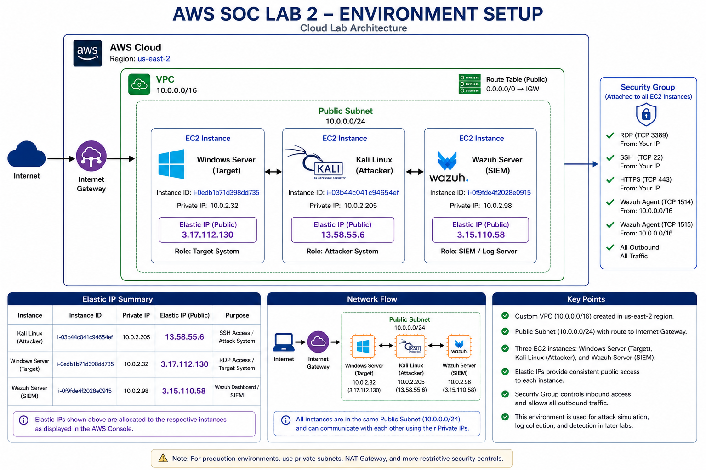

# AWS SOC Lab 2 – Environment Setup

## 📌 Objective
Design and deploy a cloud-based lab environment in AWS to support cybersecurity monitoring, attack simulation, and SIEM integration.

This lab establishes the foundational infrastructure used in later labs for detection engineering and SOC workflows.

---

## 🏗️ Environment Architecture

The lab consists of multiple EC2 instances within a custom VPC:

- **Windows Server**
  - Role: Target system (RDP exposed)
- **Linux (Kali/Ubuntu)**
  - Role: Attacker system
- **Wazuh Server**
  - Role: SIEM (log collection, detection, analysis)

---

## 🌐 Network Configuration

- Custom **VPC**
- Public **subnet**
- **Internet Gateway** attached
- Route table configured for outbound access
- Security groups configured for controlled access

---

## 🔐 Security Group Rules

| Service | Port | Purpose |
|--------|------|--------|
| RDP | 3389 | Remote access to Windows target |
| SSH | 22 | Access to Linux attacker |
| HTTPS | 443 | Wazuh dashboard |
| Wazuh | 1514/1515 | Agent communication |

---

## ⚙️ Deployment Steps

### 1. Create VPC
- Define CIDR block (e.g., 10.0.0.0/16)

### 2. Create Subnet
- Assign subnet within VPC (e.g., 10.0.1.0/24)

### 3. Configure Internet Gateway
- Attach IGW to VPC
- Update route table (0.0.0.0/0 → IGW)

### 4. Launch EC2 Instances
- Windows Server (target)
- Linux system (attacker)
- Ubuntu server (Wazuh)

### 5. Assign Elastic IPs
- Ensure consistent external access

### 6. Configure Security Groups
- Allow RDP, SSH, HTTPS, Wazuh ports

---

## ✅ Validation

Successful setup was confirmed by:

- RDP connection to Windows instance
- SSH connection to Linux instance
- Internet connectivity from all hosts

---

## 🖼️ Architecture Diagram

---

## 📸 Screenshots

Located in `/screenshots`:

1. VPC and subnet configuration  
2. EC2 instance creation  
3. Security group rules  
4. Successful RDP connection  
5. Successful SSH connection  

---

## ⚠️ Challenges & Fixes

### Issue: Instance connectivity problems
- **Cause:** Missing or incorrect route table configuration  
- **Fix:** Verified IGW attachment and updated routing

### Issue: RDP/SSH access failures
- **Cause:** Security group misconfiguration  
- **Fix:** Opened required ports (3389, 22)

---

## 🧠 Key Takeaways

- Cloud networking is critical to security visibility  
- Misconfigured routing and security groups can block access entirely  
- Elastic IPs simplify lab stability and access  
- Proper segmentation enables realistic attack simulation  

---

## 🔗 Next Steps

This environment is used in:

- Lab 3 – Wazuh SIEM Deployment  
- Lab 4 – Brute Force Detection  
- Lab 5 – Lateral Movement Detection  